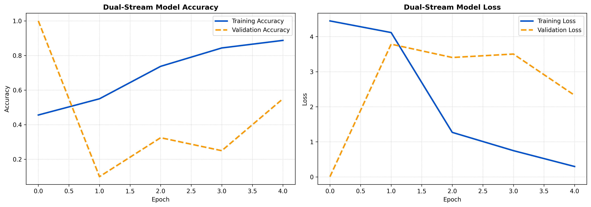

# Multimodal Deepfake Detection Engine

A dual-stream deep learning framework engineered to detect synthetic media by analyzing the cross-modal synchronization between spatial facial landmarks and audio frequencies.

## Architecture Overview
Unimodal deepfake detection systems (vision-only) are increasingly vulnerable to high-quality generative models. This engine utilizes a **Two-Stream Late Fusion** approach to identify physiological impossibilities (e.g., lip-speech mismatches).

* **Stream 1 (Spatial Visual):** Utilizes MobileNetV2 (ImageNet weights) to extract high-dimensional geometrical features from face crops (224x224), isolated using OpenCV Haar Cascades.
* **Stream 2 (Audio Frequency):** A custom Conv2D network processes 128-band Mel-spectrograms generated via Librosa to extract phonetic frequency patterns.
* **Fusion Mechanism:** The latent vectors from both streams are concatenated and passed through heavily regularized dense layers (Dropout 0.5) to evaluate synchronization, outputting a binary classification (Real vs. Synthetic).

## Baseline Training & Metrics
The pipeline was locally tested on a constrained **200-video baseline subset** of the **FaceForensics++ (C23)** dataset. This PoC was designed to validate tensor alignment, backpropagation, and loss convergence prior to cloud-scale deployment.

* **Training Convergence:** The dual-stream architecture successfully demonstrated strong learning capability, with **Training Accuracy reaching ~88%** and **Training Loss converging steadily** over the 5-epoch baseline run.
* **Validation Variance:** As expected with a constrained validation split (~40 videos), epoch-to-epoch validation variance is visible. However, the consistent training convergence validates the end-to-end data pipeline and the functional integrity of the custom fusion layer.
* **Robustness:** The C23 (H.264) variant was specifically chosen to optimize the model against real-world data degradation and media compression artifacts.

## Baseline Training Graph
*(200-video subset evaluation over 5 epochs)*

## Repository Structure
* `data_pipeline.py`: OpenCV and Librosa extraction logic.
* `fusion_model.py`: TensorFlow/Keras dual-stream architecture.
* `app.py`: Gradio interface for live inference.

## Deployment
A localized live inference endpoint was built using Gradio, allowing for real-time evaluation of `.mp4` payloads against the trained `.h5` weights.

---
*Developed by Aryan Srivastav*
